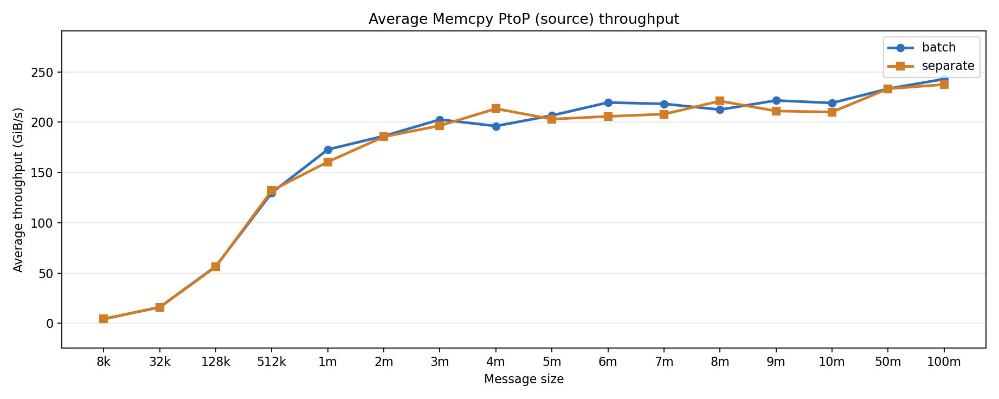
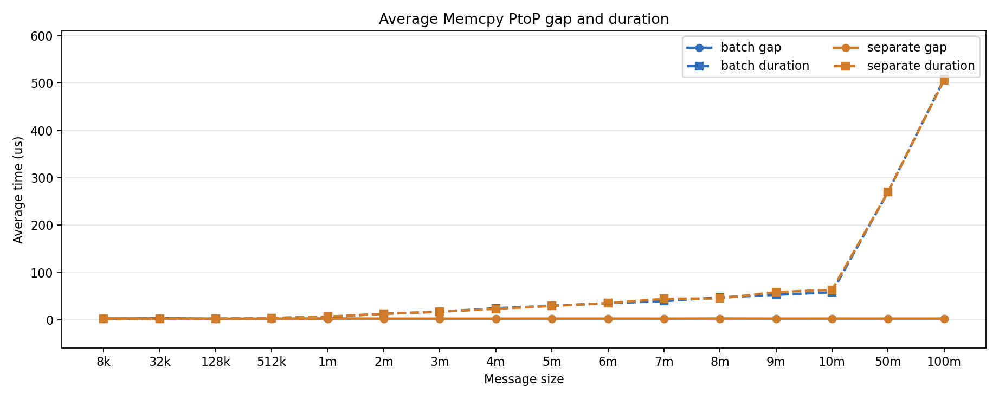
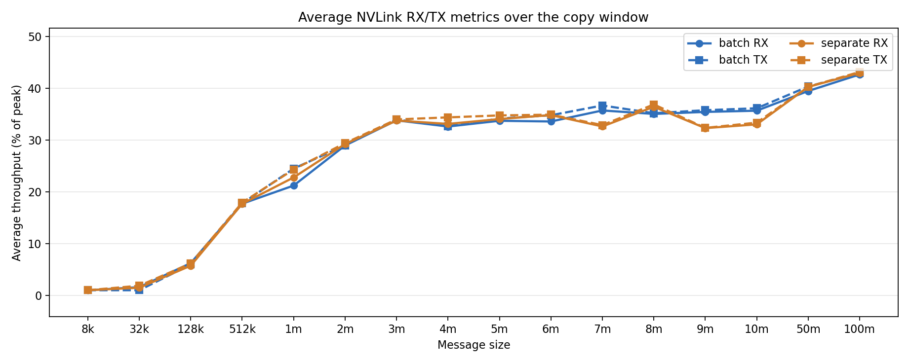

# NVLink All-To-All Copy Engine Test Results

This folder stores Nsight Systems reports and derived summaries for
`nvlink_all_to_all_copy_engine_test.py`. The reports measure peer-to-peer GPU
copies over NVLink in an all-to-all fan-out pattern. In each iteration, every
rank uses its local GPU as the source and copies the same source buffer to one
destination buffer on every other participating GPU. With 8 ranks, GPU 0 has 7
source-side destination copies per measured iteration.

The sweep compares two submission modes:

- `separate`: each rank submits 7 `cudaMemcpyPeerAsync` calls per iteration.
- `batch`: each rank submits one `cudaMemcpyBatchAsync` call per iteration,
  which appears in Nsight Systems as 7 source-side `Memcpy PtoP` activities for
  GPU 0.

Each run uses 100 measured iterations after 10 warmup iterations. The report
names encode the copy mode and message size. For example,
`a2a_batch_8M.nsys-rep` is the batched all-to-all run with `--nbytes 8M`, while
`a2a_separate_8m.nsys-rep` is the separate-call run for the same copy size. The
current sweep includes: `8k`, `32k`, `128k`, `512k`, `1m`, `2m`, `3m`, `4m`,
`5m`, `6m`, `7m`, `8m`, `9m`, `10m`, `50m`, and `100m`.

Each `.nsys-rep` file is an Nsight Systems profile containing CUDA runtime
events, NVTX ranges, cuDNN/cuBLAS tracing, and GH100 GPU metrics sampled from
GPU 0. The sibling `.sqlite` files are exported Nsight data used by the Python
analysis scripts.

Sample commands used to collect the two modes are:

```bash
nsys profile \
  -s none \
  --cpuctxsw=none \
  --trace=cuda,nvtx,cudnn,cublas \
  -o "a2a_batch_8M" \
  --gpu-metrics-devices=0 \
  --gpu-metrics-set=gh100 \
  --gpu-metrics-frequency=10000 \
  --force-overwrite=true \
  torchrun --standalone --nproc_per_node=8 nvlink_all_to_all_copy_engine_test.py \
  --nbytes 8M \
  --copy-mode batch \
  --iters 100 \
  --check
```

```bash
nsys profile \
  -s none \
  --cpuctxsw=none \
  --trace=cuda,nvtx,cudnn,cublas \
  -o "a2a_separate_8m" \
  --gpu-metrics-devices=0 \
  --gpu-metrics-set=gh100 \
  --gpu-metrics-frequency=10000 \
  --force-overwrite=true \
  torchrun --standalone --nproc_per_node=8 nvlink_all_to_all_copy_engine_test.py \
  --nbytes 8M \
  --copy-mode separate \
  --iters 100 \
  --check
```

## Scripts

`analyze_nvlink_all_to_all_copy_engine_report.py` analyzes one `.nsys-rep` or
`.sqlite` file. If given an `.nsys-rep`, it reuses the sibling `.sqlite` export
when it exists, or runs `nsys export` when needed. It reports source-side
`Memcpy PtoP` event counts, average event throughput, gaps between consecutive
copies, copy duration, wait time after the CUDA runtime API call, and NVLink
RX/TX metrics over the copy window.

For `batch` reports, the analyzer groups the multiple source-side
`Memcpy PtoP` activities that share one `cudaMemcpyBatchAsync` correlation ID.
For `separate` reports, each `cudaMemcpyPeerAsync` maps to one `Memcpy PtoP`
activity. Warmup skipping is iteration-based, so the default skip of 10
iterations removes 70 source-side `Memcpy PtoP` activities for this 8-GPU
all-to-all configuration.

Examples:

```bash
python analyze_nvlink_all_to_all_copy_engine_report.py a2a_batch_8M.nsys-rep
python analyze_nvlink_all_to_all_copy_engine_report.py a2a_separate_8m.nsys-rep
```

`plot_nvlink_all_to_all_copy_engine_summary.py` loads all available
`a2a_batch_<size>.sqlite` and `a2a_separate_<size>.sqlite` files by default,
sorts them by message size, calls the analyzer for each file, and regenerates
the three summary PNGs in this folder. Each figure includes both `batch` and
`separate` results.

Example:

```bash
python plot_nvlink_all_to_all_copy_engine_summary.py
```

## Summary Figures

### Average Memcpy PtoP Source Throughput



Observations:

- Throughput rises sharply as copy size increases. At `8k`, the average event
  throughput is about `4.317 GiB/s` for `batch` and `4.422 GiB/s` for
  `separate`.
- By `512k`, both modes are already above `129 GiB/s`: `129.776 GiB/s` for
  `batch` and `132.029 GiB/s` for `separate`.
- The `1m` to `10m` range is mostly in the `160-222 GiB/s` region, with some
  run-to-run differences between the modes. For example, `10m` is
  `219.046 GiB/s` for `batch` and `210.065 GiB/s` for `separate`.
- The large-copy points continue upward. At `50m`, both modes are about
  `233 GiB/s`; at `100m`, `batch` reaches `242.807 GiB/s` and `separate`
  reaches `237.389 GiB/s`.

### Average Memcpy PtoP Gap and Duration



Observations:

- The average inter-copy gap is low and fairly stable across the sweep. Most
  points are around `2.2 us` to `2.6 us`, with small-copy outliers such as
  `32k batch` at `3.347 us` and `8k separate` at `3.140 us`.
- `batch` reports 100 CUDA API groups after warmup, with 7 source-side
  `Memcpy PtoP` activities per group. `separate` reports 700 CUDA API groups
  after warmup, with 1 source-side `Memcpy PtoP` activity per group.
- Copy duration grows with message size: around `1.7-1.9 us` at `8k` and
  `32k`, about `58-63 us` at `10m`, about `270 us` at `50m`, and about
  `506-508 us` at `100m`.
- For small copies, fixed scheduling gaps are comparable to or larger than the
  actual copy duration. For large copies, the transfer duration dominates.

### Average NVLink RX/TX Metrics



Observations:

- RX and TX track closely in both modes, which is expected because the
  all-to-all pattern creates balanced source and destination traffic across the
  participating GPUs.
- Very small copies use little NVLink bandwidth: `8k` is about `1%` for both RX
  and TX in both modes.
- Utilization increases quickly through the mid-size range. Around `2m`, both
  modes are near `29%`; around `8m`, the stronger points are roughly
  `35-37%`.
- The large-copy points show the highest observed NVLink metrics. At `50m`,
  both modes are around `40%` RX/TX. At `100m`, both modes are around
  `42-43%` RX/TX, with `separate` slightly higher on the sampled GPU metrics.
