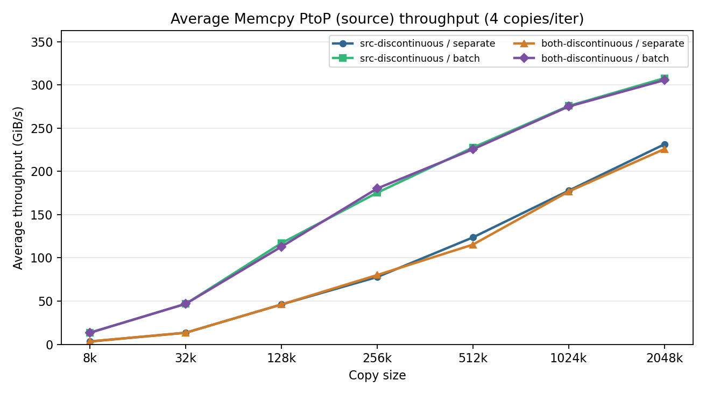
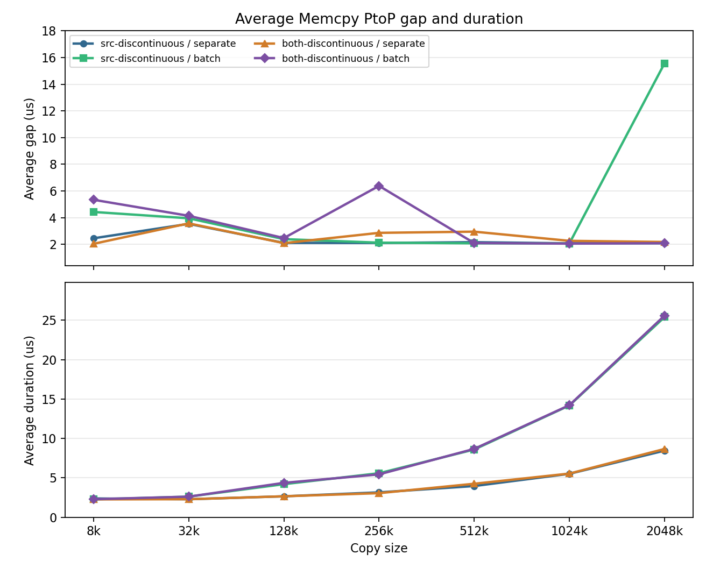
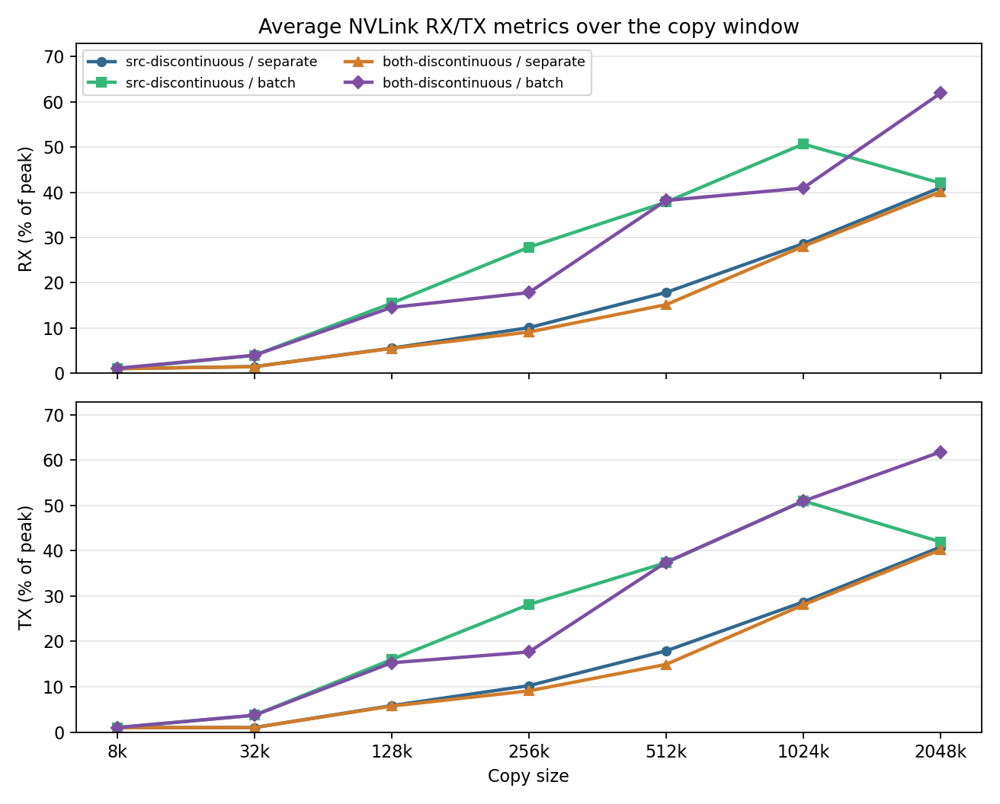
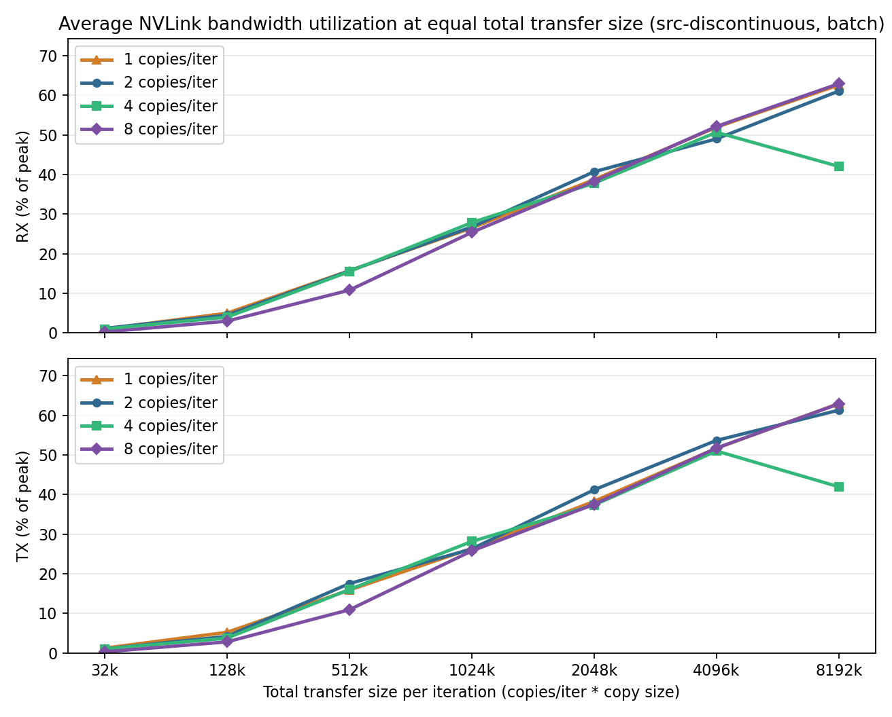

# NVLink Batch Address Layout Test Results

This folder stores Nsight Systems reports and derived summaries for
`nvlink_batch_address_layout_test.py`. The reports measure peer-to-peer GPU
copies over NVLink in a ring pattern while changing the source/destination
address layout and the copy submission mode.

Each run uses `--copies-per-iter 4`, 100 measured iterations, and 10 warmup
iterations. The current sweep includes copy sizes `8k`, `32k`, `128k`, `256k`,
`512k`, `1024k`, and `2048k`. The collected layout folders are:

- `src_discontinuous`: results collected with `--layout src-discontinuous`
- `both_discontinuous`: results collected with `--layout both-discontinuous`

The report filenames encode the copy count, copy size, and copy mode. For
example, `both_discontinuous/4*8k_separate.nsys-rep` is the run with
`--copies-per-iter 4`, `--copy-size 8K`, `--layout both-discontinuous`, and
`--copy-mode separate`.

Each `.nsys-rep` file is an Nsight Systems profile containing CUDA runtime
events, NVTX ranges, cuDNN/cuBLAS tracing, and GH100 GPU metrics sampled from
GPU 0. The sibling `.sqlite` files are exported Nsight data used by the Python
analysis scripts.

A sample command used to collect one result is:

```bash
nsys profile \
  -s none \
  --cpuctxsw=none \
  --trace=cuda,nvtx,cudnn,cublas \
  -o "./nvlink_batch_address_layout_test/both_discontinuous/4*8k_separate" \
  --gpu-metrics-devices=0 \
  --gpu-metrics-set=gh100 \
  --gpu-metrics-frequency=10000 \
  --force-overwrite=true \
  torchrun --standalone --nproc_per_node=8 nvlink_batch_address_layout_test.py \
    --copy-size 8K \
    --copies-per-iter 4 \
    --layout both-discontinuous \
    --gap-size 10M \
    --copy-mode separate \
    --check
```

## Scripts

`analyze_nvlink_batch_address_layout_report.py` analyzes one `.nsys-rep` or
`.sqlite` file. If given an `.nsys-rep`, it reuses the sibling `.sqlite` export
when it exists, or runs `nsys export` when needed. It reports source-side
`Memcpy PtoP` event counts, average event throughput, gaps between consecutive
copies, copy duration, wait time after `cudaMemcpyPeerAsync`, and NVLink RX/TX
metrics over the copy window.

By default, the analyzer infers the warmup skip from the 10 warmup iterations
and 100 measured iterations. This keeps `separate` runs, which record 4 source
Memcpy PtoP events per iteration, aligned with `batch` runs, which record 1
source Memcpy PtoP event per iteration in this dataset.

Example:

```bash
python analyze_nvlink_batch_address_layout_report.py \
  "both_discontinuous/4*8k_separate.nsys-rep"
```

`plot_nvlink_batch_address_layout_summary.py` loads all available
`*/*.sqlite` files by default, sorts them by copy size, calls the analyzer for
each file, and regenerates the three summary PNGs in this folder. Each figure
compares the available `--layout` and `--copy-mode` combinations.

Example:

```bash
python plot_nvlink_batch_address_layout_summary.py
```

`plot_nvlink_copies_per_iter_comparison.py` focuses on the
`src-discontinuous / batch` runs and compares `--copies-per-iter 1`, `2`, `4`,
and `8` at the same total transfer size per iteration. The x-axis is
`copies_per_iter * copy_size`, so points such as `1*32k`, `2*16k`, `4*8k`, and
`8*4k` are compared at the same `32k` total transfer size.

Example:

```bash
python plot_nvlink_copies_per_iter_comparison.py
```

## Summary Figures

### Average Memcpy PtoP Source Throughput



Observations:

- Throughput rises with copy size for every layout/mode combination.
- `batch` mode is much faster than `separate` mode across the sweep. At
  `2048k`, `src-discontinuous / batch` reaches `307.764 GiB/s`, while
  `src-discontinuous / separate` reaches `231.287 GiB/s`.
- The two layout choices are very close in `batch` mode. At `1024k`, the
  measured averages are `275.618 GiB/s` for `src-discontinuous / batch` and
  `275.012 GiB/s` for `both-discontinuous / batch`.
- In `separate` mode, the layout difference is also small. The `2048k` point is
  `231.287 GiB/s` for `src-discontinuous` and `225.802 GiB/s` for
  `both-discontinuous`.

### Average Memcpy PtoP Gap and Duration



Observations:

- `separate` mode records 400 measured source Memcpy PtoP events after skipping
  40 warmup events, while `batch` mode records 100 measured source events after
  skipping 10 warmup events.
- Most average gaps are near `2 us` to `5 us`. The two visible outliers are
  `both-discontinuous / batch` at `256k` with `6.382 us` and
  `src-discontinuous / batch` at `2048k` with `15.569 us`.
- Copy duration grows with copy size. In `batch` mode, duration increases from
  about `2.26 us` at `8k` to about `25.4 us` to `25.6 us` at `2048k`.
- For the same copy size, `batch` mode has a longer single recorded Memcpy PtoP
  duration because each batch activity represents the four copies submitted in
  that iteration.

### Average NVLink RX/TX Metrics



Observations:

- NVLink utilization generally increases with copy size, especially for the
  `batch` runs.
- `separate` mode reaches about `40%` to `41%` of peak at `2048k` for both
  layouts.
- `both-discontinuous / batch` reaches the highest `2048k` utilization in this
  sweep, with RX `61.857%` and TX `61.786%` of peak.
- RX and TX usually track closely. One notable asymmetry appears at
  `1024k` for `both-discontinuous / batch`, where RX is `40.941%` and TX is
  `50.941%`.

### NVLink Utilization at Equal Total Transfer Size



Observations:

- This figure compares `src-discontinuous / batch` runs while keeping the total
  bytes per iteration fixed on the x-axis.
- At small total sizes, fewer copies per iteration are generally more efficient.
  For total `128k`, `1` copy per iteration reaches RX `5.000%` and TX
  `5.200%`, while `8` copies per iteration reaches RX `3.000%` and TX
  `2.778%`.
- Around total `1024k` to `4096k`, all four copy counts are close. At total
  `4096k`, RX ranges from `49.000%` to `52.125%`, and TX ranges from
  `51.000%` to `53.688%`.
- At total `8192k`, `1`, `2`, and `8` copies per iteration are all around
  `61%` to `63%` of peak, while the `4` copies-per-iteration point is lower at
  RX `42.024%` and TX `41.951%`.
