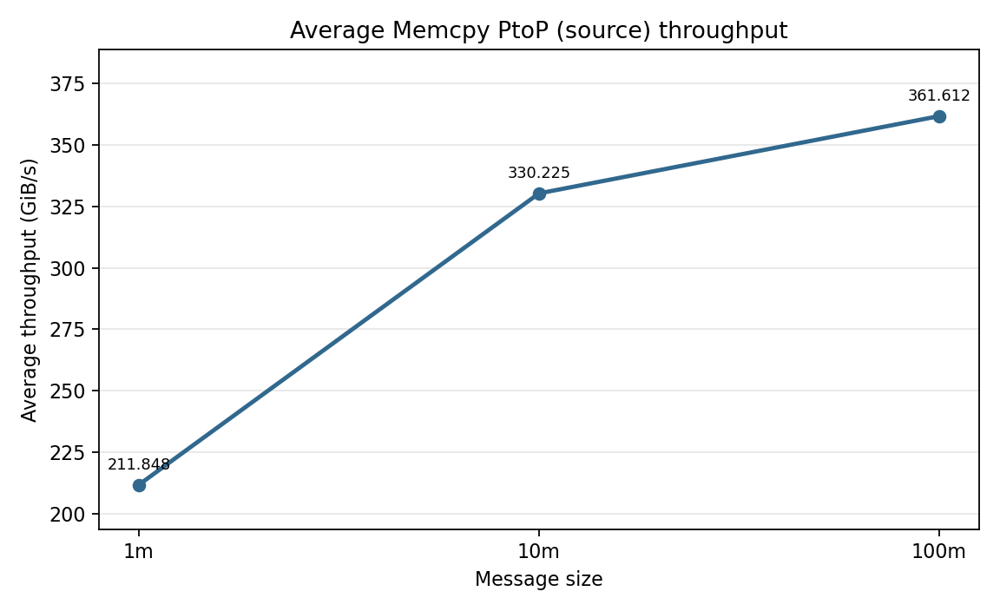
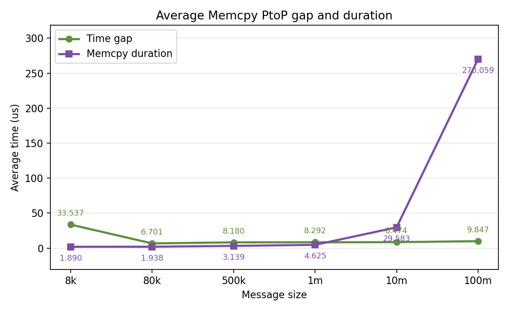
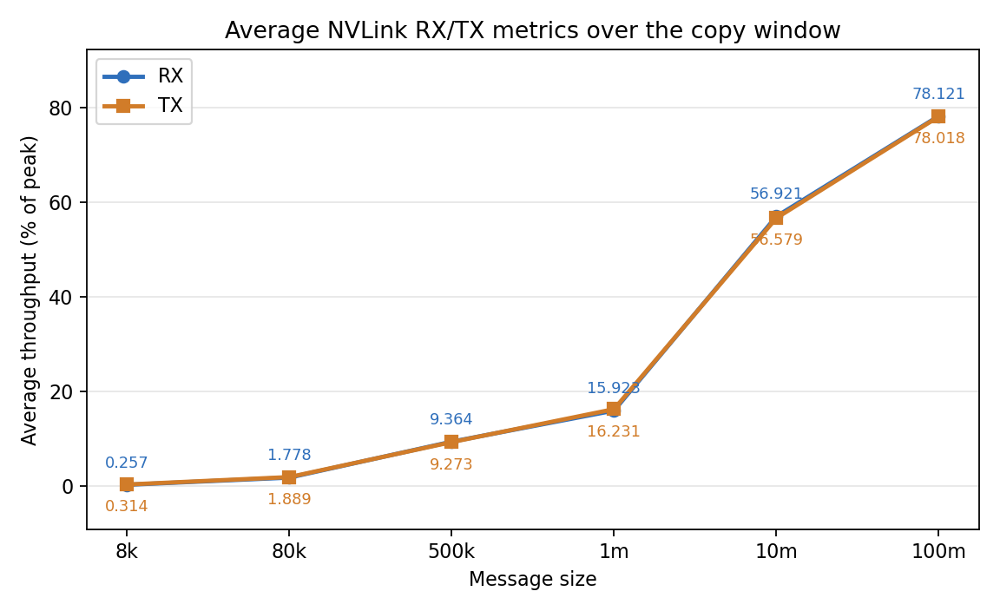

# NVLink Copy Engine Test Results

This folder stores Nsight Systems reports and derived summaries for
`nvlink_copy_engine_test.py`. The reports measure peer-to-peer GPU copies over
NVLink in a ring pattern. In this test, each GPU sends data to exactly one
other GPU, so the traffic is one-to-one per GPU rather than one-to-many fan-out.
Each run uses one copy per iteration and 100 measured iterations after 10
warmup iterations.

The report names encode the copy size. For example, `1*8m.nsys-rep` is the run
with `--copies-per-iter 1` and `--copy-size 8M`. The current sweep includes:
`8k`, `80k`, `500k`, `1m`, `2m`, `3m`, `4m`, `5m`, `6m`, `8m`, `10m`, and
`100m`.

Each `.nsys-rep` file is an Nsight Systems profile containing CUDA runtime
events, NVTX ranges, cuDNN/cuBLAS tracing, and GH100 GPU metrics sampled from
GPU 0. The sibling `.sqlite` files are exported Nsight data used by the Python
analysis scripts.

A sample command used to collect one result is:

```bash
nsys profile \
  -s none \
  --cpuctxsw=none \
  --trace=cuda,nvtx,cudnn,cublas \
  -o 1*8m_seperate \
  --gpu-metrics-devices=0 \
  --gpu-metrics-set=gh100 \
  --gpu-metrics-frequency=10000 \
  --force-overwrite=true \
  torchrun --standalone --nproc_per_node=8 nvlink_copy_engine_test.py \
  --copy-size 8M \
  --copies-per-iter 1 \
  --copy-mode separate \
  --iters 100 \
  --warmup 10 \
  --mode ring \
  --check
```

## Scripts

`analyze_nvlink_copy_engine_report.py` analyzes one `.nsys-rep` or `.sqlite`
file. If given an `.nsys-rep`, it reuses the sibling `.sqlite` export when it
exists, or runs `nsys export` when needed. It reports source-side
`Memcpy PtoP` event counts, average event throughput, gaps between consecutive
copies, copy duration, wait time after `cudaMemcpyPeerAsync`, and NVLink RX/TX
metrics over the copy window.

Example:

```bash
python analyze_nvlink_copy_engine_report.py "1*8m.nsys-rep"
```

`plot_nvlink_copy_engine_summary.py` loads all available `1*<size>.sqlite`
files by default, sorts them by message size, calls the analyzer for each file,
and regenerates the three summary PNGs in this folder.

Example:

```bash
python plot_nvlink_copy_engine_summary.py
```

## Summary Figures

### Average Memcpy PtoP Source Throughput



Observations:

- Throughput rises sharply as copy size increases, from about `4.083 GiB/s` at
  `8k` to `211.848 GiB/s` at `1m`.
- The mid-size range continues improving but begins to flatten: `2m` is
  `265.573 GiB/s`, `4m` is `306.388 GiB/s`, and `8m` is `332.955 GiB/s`.
- Large transfers are near the plateau region. `10m` is slightly lower than
  `8m` at `330.225 GiB/s`, while `100m` reaches the highest observed average at
  `361.612 GiB/s`.

### Average Memcpy PtoP Gap and Duration



Observations:

- The average inter-copy gap is high for very small copies: `33.537 us` at
  `8k`.
- From `80k` through `10m`, the gap is relatively stable, mostly between about
  `6.7 us` and `8.9 us`.
- Copy duration grows with message size, from `1.890 us` at `8k` to
  `29.583 us` at `10m`, then jumps to `270.059 us` at `100m`.
- For small copies, fixed launch/scheduling gaps are comparable to or larger
  than the actual copy duration. For larger copies, the transfer duration
  dominates.

### Average NVLink RX/TX Metrics



Observations:

- RX and TX track very closely across the sweep, which is expected for the ring
  peer-copy pattern.
- NVLink utilization increases with copy size, from below `1%` at `8k` to
  around `16%` at `1m`.
- The new `2m` to `8m` points show the utilization ramp clearly: about `26%` at
  `2m`, `42%` at `4m`, `49%` at `6m`, and `54%` at `8m`.
- `100m` reaches the highest observed NVLink metric level, about `78%` of peak
  for both RX and TX.
