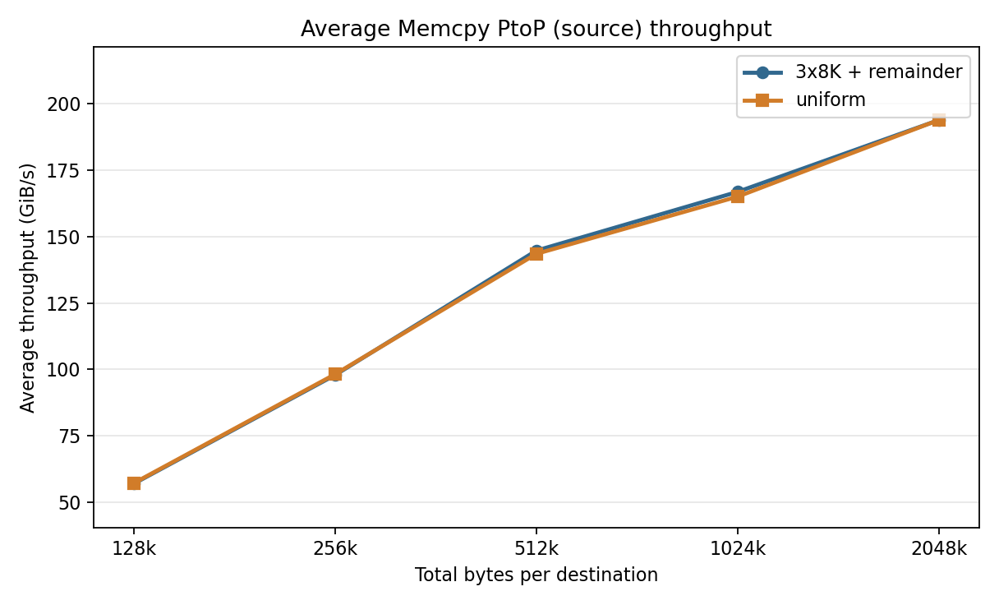
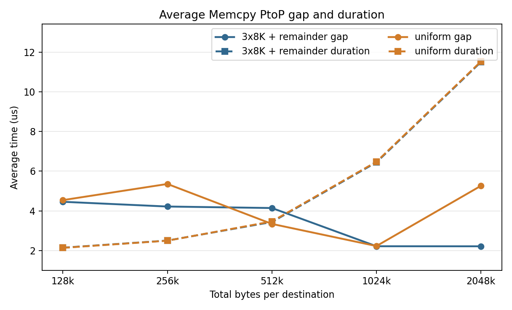
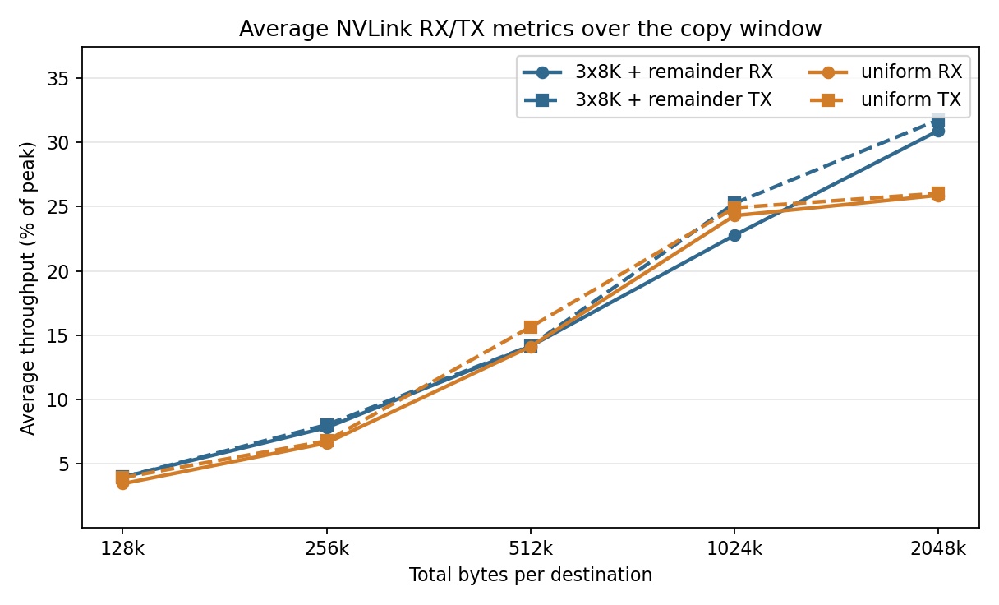
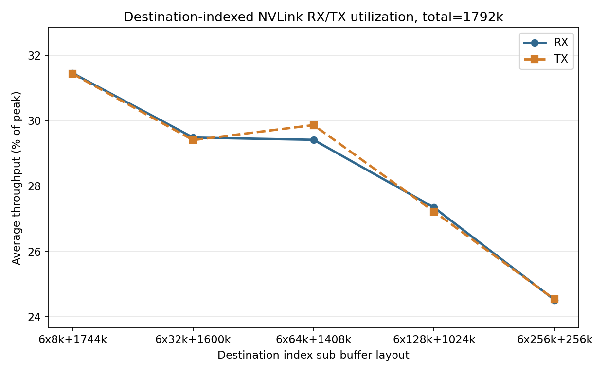

# NVLink Multi-Source All-To-All Batch Test Results

This folder stores Nsight Systems reports and derived summaries for
`nvlink_multi_source_all_to_all_batch_test.py`. The reports measure batched
peer-to-peer GPU copies over NVLink in a multi-source all-to-all pattern.

Each rank owns one source GPU with 4 logical source buffers. Each logical source
buffer is split into 7 contiguous sub-buffers, one for each other GPU in an
8-GPU run. In every iteration, each rank submits one `cudaMemcpyBatchAsync` per
destination GPU. Each batch contains the 4 source-buffer chunks for that
destination.

The first sweep compares two source-buffer size layouts:

- `3x8K + remainder`: three source buffers contribute `8K` chunks and the
  fourth contributes the remaining bytes.
- `uniform`: all 4 source buffers contribute equal-size chunks.

Each run uses 100 measured iterations after 10 warmup iterations. The total
message sizes per destination are `128k`, `256k`, `512k`, `1024k`, and `2048k`.
For example, `total_512k_batch_3x8k+488k.nsys-rep` is the run where each
destination batch moves `8K + 8K + 8K + 488K = 512K`, while
`total_512k_batch_uniform_buffer_sizes.nsys-rep` moves `128K` from each of the
4 source buffers.

Each `.nsys-rep` file is an Nsight Systems profile containing CUDA runtime
events, NVTX ranges, cuDNN/cuBLAS tracing, and GH100 GPU metrics sampled from
GPU 0. The sibling `.sqlite` files are exported Nsight data used by the Python
analysis scripts.

The updated reports include source-side `Memcpy PtoP` activities. In these
reports, each `cudaMemcpyBatchAsync` destination batch appears as one coalesced
source-side `Memcpy PtoP` activity, not as 4 separate activities for A/B/C/D.
Therefore the analyzer reports `ptop_events/batch=1` and
`source_buffers/batch=4`.

The newer destination-indexed sweep uses the benchmark's
`--destination-buffer-sizes` mode. It keeps the total bytes per source buffer at
`1792K` while changing the size distribution across the 7 destination-indexed
chunks. For example,
`total_1792k_different_dst_sizes_batch_6*64k+1408k.nsys-rep` means chunks
1 through 6 are `64K`, chunk 7 is `1408K`, and each source buffer A/B/C/D uses
that same destination-indexed pattern.

Sample commands used to collect the two layouts are:

```bash
num_src_buffers=4

for i in 128 256 512 1024 2048; do
  total_k=$((1 * i))
  last_copy_size=$((total_k - (num_src_buffers - 1) * 8))

  source_buffer_sizes=""
  for ((j = 0; j < num_src_buffers - 1; j++)); do
    source_buffer_sizes+="8K,"
  done
  source_buffer_sizes+="${last_copy_size}K"

  nsys profile \
    -s none \
    --cpuctxsw=none \
    --trace=cuda,nvtx,cudnn,cublas \
    -o "./nvlink_multi_source_all_to_all_batch_test/total_${total_k}k_batch_3x8k+${last_copy_size}k" \
    --gpu-metrics-devices=0 \
    --gpu-metrics-set=gh100 \
    --gpu-metrics-frequency=10000 \
    --force-overwrite=true \
    torchrun --standalone --nproc_per_node=8 nvlink_multi_source_all_to_all_batch_test.py \
      --num_source_buffers "${num_src_buffers}" \
      --source-buffer-sizes "${source_buffer_sizes}" \
      --copy-mode batch \
      --iters 100 \
      --warmup 10 \
      --check
done
```

```bash
num_src_buffers=4

for i in 128 256 512 1024 2048; do
  total_k=$((1 * i))
  equal_source_buffer_size=$((total_k / num_src_buffers))

  source_buffer_sizes=""
  for ((j = 0; j < num_src_buffers - 1; j++)); do
    source_buffer_sizes+="${equal_source_buffer_size}K,"
  done
  source_buffer_sizes+="${equal_source_buffer_size}K"

  nsys profile \
    -s none \
    --cpuctxsw=none \
    --trace=cuda,nvtx,cudnn,cublas \
    -o "./nvlink_multi_source_all_to_all_batch_test/total_${total_k}k_batch_uniform_buffer_sizes" \
    --gpu-metrics-devices=0 \
    --gpu-metrics-set=gh100 \
    --gpu-metrics-frequency=10000 \
    --force-overwrite=true \
    torchrun --standalone --nproc_per_node=8 nvlink_multi_source_all_to_all_batch_test.py \
      --num_source_buffers "${num_src_buffers}" \
      --source-buffer-sizes "${source_buffer_sizes}" \
      --copy-mode batch \
      --iters 100 \
      --warmup 10 \
      --check
done
```

Sample command used to collect the destination-indexed layout sweep:

```bash
num_dst_buffers=7

for i in 8 32 64 128 256; do
  total_k=$((7*1024/4))
  last_dst_buffer_size=$((total_k - (num_dst_buffers - 1) * i))

  dst_buffer_sizes=""
  for ((j = 0; j < num_dst_buffers - 1; j++)); do
    dst_buffer_sizes+="${i}K,"
  done
  dst_buffer_sizes+="${last_dst_buffer_size}K"

  nsys profile \
    -s none \
    --cpuctxsw=none \
    --trace=cuda,nvtx,cudnn,cublas \
    -o "./nvlink_multi_source_all_to_all_batch_test/total_${total_k}k_different_dst_sizes_batch_6*${i}k+${last_dst_buffer_size}k" \
    --gpu-metrics-devices=0 \
    --gpu-metrics-set=gh100 \
    --gpu-metrics-frequency=10000 \
    --force-overwrite=true \
    torchrun --standalone --nproc_per_node=8 nvlink_multi_source_all_to_all_batch_test.py \
      --num_source_buffers 4 \
      --destination-buffer-sizes "${dst_buffer_sizes}" \
      --copy-mode batch \
      --iters 100 \
      --warmup 10 \
      --check
done
```

## Scripts

`analyze_nvlink_multi_source_all_to_all_batch_report.py` analyzes one
`.nsys-rep` or `.sqlite` file. If given an `.nsys-rep`, it reuses the sibling
`.sqlite` export when it exists, or runs `nsys export` when needed. It reports
source-side `Memcpy PtoP` event counts, average event throughput, gaps between
consecutive copies, copy duration, wait time after `cudaMemcpyBatchAsync`, and
NVLink RX/TX metrics over the copy window.

Example:

```bash
python analyze_nvlink_multi_source_all_to_all_batch_report.py \
  total_512k_batch_3x8k+488k.nsys-rep
```

`plot_nvlink_multi_source_all_to_all_batch_summary.py` loads all available
`total_*_batch_3x8k+*.sqlite` and
`total_*_batch_uniform_buffer_sizes.sqlite` files by default, sorts them by
total bytes per destination, calls the analyzer for each file, and regenerates
the three summary PNGs in this folder. Each figure includes both source-buffer
layouts.

Example:

```bash
python plot_nvlink_multi_source_all_to_all_batch_summary.py
```

`plot_nvlink_multi_source_different_dst_sizes.py` loads
`total_*_different_dst_sizes_batch_*.sqlite` files, sorts them by the repeated
small destination chunk size, and generates the destination-indexed NVLink
RX/TX utilization figure.

Example:

```bash
python plot_nvlink_multi_source_different_dst_sizes.py
```

## Summary Figures

### Average Memcpy PtoP Source Throughput



Observations:

- Throughput increases with total bytes per destination for both layouts.
- At `128k`, the two layouts are nearly identical: `57.062 GiB/s` for
  `3x8K + remainder` and `57.267 GiB/s` for `uniform`.
- At `256k`, both layouts are also close: `97.914 GiB/s` for
  `3x8K + remainder` and `98.214 GiB/s` for `uniform`.
- From `512k` through `2048k`, the two layouts remain close in average
  source-side PtoP throughput. At `2048k`, both are about `193.8 GiB/s`.

### Average Memcpy PtoP Gap and Duration



Observations:

- The profiler shows one source-side `Memcpy PtoP` activity per destination
  batch, so each post-warmup GPU 0 report has 700 PtoP activities:
  `100 iterations * 7 destination batches`.
- PtoP duration grows with total bytes per destination. For `3x8K + remainder`,
  it rises from `2.146 us` at `128k` to `11.499 us` at `2048k`.
- Uniform-buffer PtoP duration closely tracks the `3x8K + remainder` layout:
  `2.138 us` at `128k` and `11.527 us` at `2048k`.
- Inter-copy gaps are small, mostly a few microseconds. The largest visible
  layout differences are in the gap metric, for example `2048k` has
  `2.216 us` for `3x8K + remainder` and `5.264 us` for `uniform`.

### Average NVLink RX/TX Metrics



Observations:

- NVLink utilization increases with total bytes per destination for both
  layouts.
- At small sizes, utilization is low: around `3-8%` RX/TX for `128k` and
  `256k`.
- At `512k`, both layouts are around the mid-teens in percent-of-peak NVLink
  metrics, with the uniform run showing slightly higher TX in this sample.
- At `1024k` and `2048k`, the `3x8K + remainder` layout reaches higher sampled
  NVLink metrics in this run. At `2048k`, it reports about `30.9%` RX and
  `31.7%` TX, while the uniform run reports about `25.9%` RX and `26.0%` TX.

### Destination-Indexed NVLink RX/TX Metrics



Observations:

- This sweep keeps each source buffer's total destination-indexed extent fixed
  at `1792K`, so the x-axis changes layout shape rather than total bytes.
- The most skewed destination-indexed layout, `6x8k+1744k`, has the highest
  sampled NVLink utilization: `31.449%` RX and `31.429%` TX.
- Utilization generally decreases as the destination chunks become more
  balanced. The `6x256k+256k` layout reports `24.516%` RX and `24.532%` TX.
- RX and TX track each other closely across the sweep, with the largest small
  separation at `6x64k+1408k`: `29.412%` RX and `29.863%` TX.
