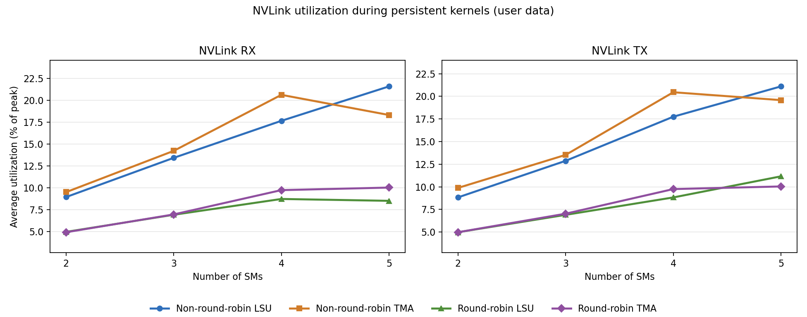

# LSU/TMA NVLink Copy Test Results

This folder stores Nsight Systems reports and derived summaries for the LSU/TMA
NVLink copy benchmarks:

- `../nvlink_lsu_tma_copy_test.py`
- `../nvlink_lsu_tma_round_robin_copy_test.py`

These reports measure GPU-to-GPU peer traffic over NVLink using SM-side copy
kernels instead of CUDA copy-engine APIs. The current sweep uses 8 ranks/GPUs,
`--copy-size 1M`, `--iters 100`, source-side execution, persistent kernels, and
SM counts of `2`, `3`, `4`, and `5`.

The sweep compares four combinations:

- non-round-robin `lsu`
- non-round-robin `tma`
- round-robin `lsu`
- round-robin `tma`

Each `.nsys-rep` file is an Nsight Systems profile containing CUDA runtime
events, NVTX ranges, cuDNN/cuBLAS tracing, and GH100 GPU metrics sampled from
GPU 0. The sibling `.sqlite` files are exported Nsight data used by the Python
analysis scripts.

## Result Layout

`nvlink_lsu_tma_copy_test/` contains the one-source-to-one-destination runs.
The report names encode the method, persistent-kernel mode, SM count, and copy
size. For example:

- `lsu_persistent_sm*3_1m.nsys-rep`
- `tma_persistent_sm*3_1m.nsys-rep`

`nvlink_lsu_tma_round_robin_copy_test/` contains the one-source-to-many
round-robin runs. The report names additionally encode the TMA tile parameters
used for the sweep. For example:

- `round_robin_lsu_persistent_sm*3_intra_64k_inter_8k_1m.nsys-rep`
- `round_robin_tma_persistent_sm*3_intra_64k_inter_8k_1m.nsys-rep`

## How The Reports Were Collected

A representative non-round-robin TMA run is:

```bash
nsys profile \
  -s none \
  --cpuctxsw=none \
  --trace=cuda,nvtx,cudnn,cublas \
  -o "tma_persistent_sm*3_1m" \
  --gpu-metrics-devices=0 \
  --gpu-metrics-set=gh100 \
  --gpu-metrics-frequency=10000 \
  --force-overwrite=true \
  torchrun --standalone --nproc_per_node=8 ../../nvlink_lsu_tma_copy_test.py \
    --copy-size 1M \
    --iters 100 \
    --method tma \
    --executor src \
    --num-sms 3 \
    --persistent-kernel \
    --check
```

A representative non-round-robin LSU run is the same command with:

```bash
  -o "lsu_persistent_sm*3_1m" \
  ...
    --method lsu \
```

A representative round-robin TMA run is:

```bash
nsys profile \
  -s none \
  --cpuctxsw=none \
  --trace=cuda,nvtx,cudnn,cublas \
  -o "round_robin_tma_persistent_sm*3_intra_64k_inter_8k_1m" \
  --gpu-metrics-devices=0 \
  --gpu-metrics-set=gh100 \
  --gpu-metrics-frequency=10000 \
  --force-overwrite=true \
  torchrun --standalone --nproc_per_node=8 ../../nvlink_lsu_tma_round_robin_copy_test.py \
    --copy-size 1M \
    --iters 100 \
    --method tma \
    --executor src \
    --num-sms 3 \
    --tma-tile-bytes 64K \
    --tma-inter-tile-bytes 8K \
    --round-robin-bytes 8K \
    --persistent-kernel \
    --check
```

A representative round-robin LSU run is the same command with:

```bash
  -o "round_robin_lsu_persistent_sm*3_intra_64k_inter_8k_1m" \
  ...
    --method lsu \
```

The same command pattern was repeated for `--num-sms 2`, `3`, `4`, and `5`.

## Scripts

`analyze_nvlink_lsu_tma_report.py` analyzes one `.nsys-rep` or `.sqlite` file.
If given an `.nsys-rep`, it reuses the sibling `.sqlite` export when it exists,
or runs `nsys export` when needed. It auto-detects the copy kernel:

- `lsu_copy_kernel`
- `tma_copy_kernel`
- `lsu_round_robin_copy_kernel`
- `tma_round_robin_copy_kernel`

The analyzer skips one warmup persistent-kernel launch by default and reports
average NVLink RX/TX metrics over the timed persistent-kernel window.

Example:

```bash
python analyze_nvlink_lsu_tma_report.py \
  "nvlink_lsu_tma_round_robin_copy_test/round_robin_tma_persistent_sm*3_intra_64k_inter_8k_1m.sqlite"
```

`plot_nvlink_lsu_tma_sm_summary.py` loads all available LSU/TMA result
`.sqlite` files by default, calls the analyzer for each file, and regenerates
the SM-sweep summary figure.

Example:

```bash
python plot_nvlink_lsu_tma_sm_summary.py
```

To plot protocol traffic together with user data:

```bash
python plot_nvlink_lsu_tma_sm_summary.py --nvlink-mode user-plus-protocol
```

## Summary Figure

### Average NVLink RX/TX Utilization During Persistent Kernels



The figure plots the average NVLink user-data throughput metric as a percentage
of peak. The x-axis is the requested SM count. RX and TX are shown as separate
panels, and each panel includes the four benchmark combinations.

Values plotted:

| Test | Method | SMs | RX % | TX % |
| --- | --- | ---: | ---: | ---: |
| non-round-robin | LSU | 2 | 8.958 | 8.833 |
| non-round-robin | LSU | 3 | 13.438 | 12.875 |
| non-round-robin | LSU | 4 | 17.667 | 17.750 |
| non-round-robin | LSU | 5 | 21.600 | 21.100 |
| non-round-robin | TMA | 2 | 9.520 | 9.880 |
| non-round-robin | TMA | 3 | 14.235 | 13.529 |
| non-round-robin | TMA | 4 | 20.636 | 20.455 |
| non-round-robin | TMA | 5 | 18.333 | 19.583 |
| round-robin | LSU | 2 | 4.978 | 4.978 |
| round-robin | LSU | 3 | 6.935 | 6.903 |
| round-robin | LSU | 4 | 8.739 | 8.826 |
| round-robin | LSU | 5 | 8.526 | 11.158 |
| round-robin | TMA | 2 | 4.938 | 4.979 |
| round-robin | TMA | 3 | 6.972 | 7.028 |
| round-robin | TMA | 4 | 9.750 | 9.750 |
| round-robin | TMA | 5 | 10.040 | 10.040 |

Observations:

- Non-round-robin traffic reaches higher sampled NVLink utilization than the
  round-robin traffic in this 1M sweep.
- Non-round-robin TMA scales from about `9.5%` at 2 SMs to about `20.6%` at
  4 SMs, then drops slightly at 5 SMs in this run.
- Non-round-robin LSU scales steadily from about `9%` at 2 SMs to about `21%`
  at 5 SMs, with RX and TX staying close to each other.
- Round-robin LSU and TMA are close to each other from 2 to 4 SMs. At 5 SMs,
  round-robin LSU has higher TX than RX, while round-robin TMA remains balanced
  at about `10%`.
