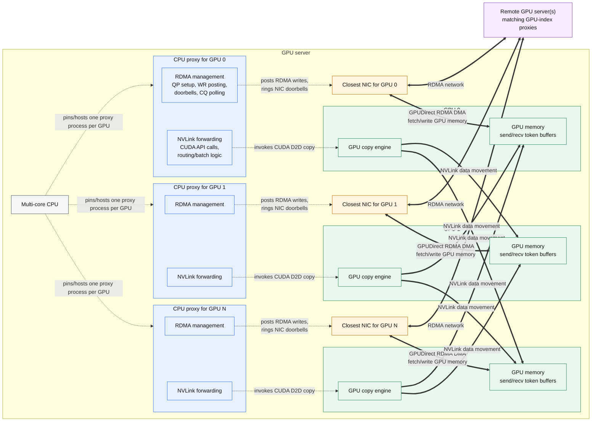

# System Architecture Graph 01: CPU Proxy, RDMA, and NVLink

Legend:

- Dashed arrows: CPU proxy control path.
- Thick arrows: hardware-actuated data movement.
- Each proxy owns one local GPU and uses that GPU's closest NIC for RDMA.
- RDMA payload bytes move directly between the NIC and GPU memory through GPUDirect RDMA.
- NVLink forwarding is submitted by the CPU proxy through CUDA, then performed by GPU copy engines.
